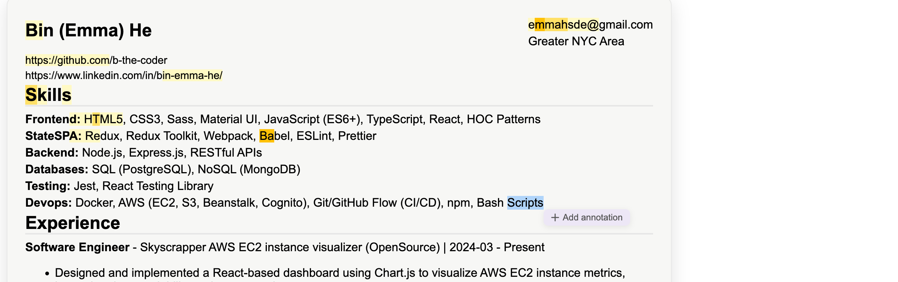
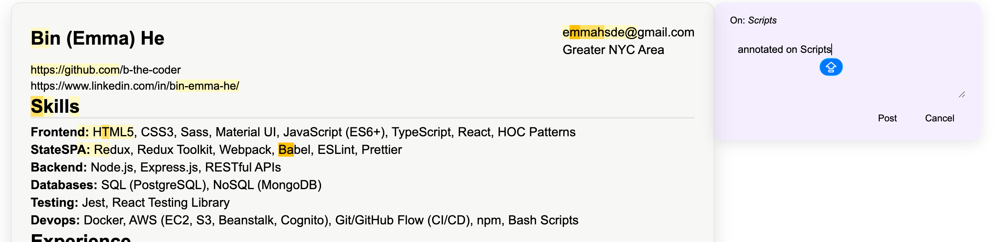
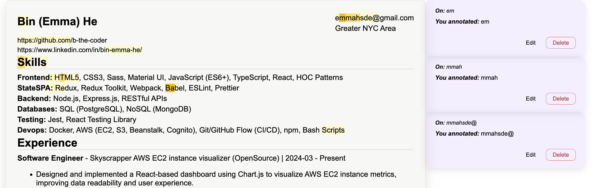

This repo is for a webpage that you can showcase your personal info and professional experience, including to display a resume that allow annotation. The page also support dark mode view.

## Prerequisites

Before running this project locally, make sure you have:

- [Git](https://git-scm.com/) — required to clone the repository
- [Node.js](https://nodejs.org/) 22.12.0 or later
- npm — included with Node.js
- A modern web browser

## Getting Started

1. Clone the repository:

   ```bash
   git clone https://github.com/b-the-coder/personal_website.git
   ```

2. Navigate to the project directory:

   ```bash
   cd personal_website
   ```

3. Install the dependencies:

   ```bash
   npm ci
   ```

4. Start the development server:

   ```bash
   npm run dev
   ```

5. Open the local URL displayed in the terminal, usually:

   ```text
   http://localhost:5173
   ```

## Testing

Run the test suite:

```bash
npm test
```

Run the tests and generate a coverage report:

```bash
npm run test:coverage
```

## Demo

1. Select the text you want to annotate and post an annotation.
2. Annotated text will be highlighted.
3. The highlight color becomes darker as more annotations are added to the same text, up to three levels.
4. Click the highlighted text to view its annotations.
5. Existing annotations can be edited or deleted.

## Screenshots

### Select Text and Post an Annotation




### Different level of highlight and View/Edit Annotations



## Use Your Own Resume

Update the values in `resumeData.json` with your own resume information.

## Known Limitations

This function does not support annotations that span across different text segments.
If a user selects content across multiple text segments, only the text in the first segment will be highlighted. However, the saved annotation object will still match the user's selection.
